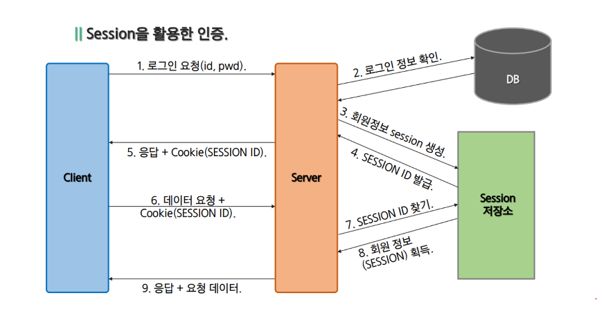
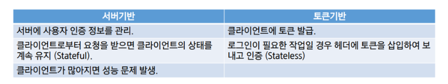
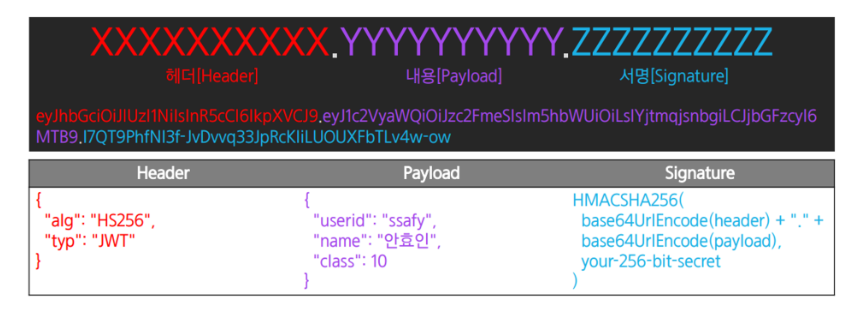
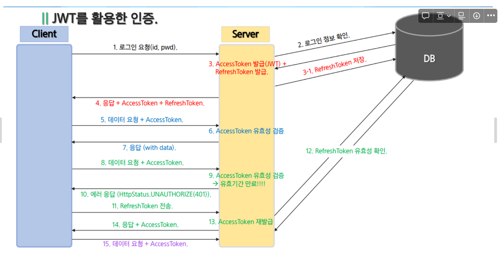

# jwt 정리

# 로그인

### Cookie를 활용한 인증

- Cookie
    - 클라이언트가 웹사이트에 접속할 때 사용되는 기록 파일(client의 browse에 저장)
    - Key, Value 형식으로 문자열 형태로 저장
- 로그인 과정
    1. 서버가 클라이언트에 정보를 전달할 때 저장하고자 하는 정보를 응답 헤더(Cookie)에 저장하여 전달
    2. 해당 클라이언트는 서버에 요청을 보낼 때마다, 매번 저장된 쿠키를 요청 헤더의 Cookie에 담아 전달
    3. 서버는 쿠키의 정보를 이용하여 해당 요청의 클라이언트 식별이 가능
- 단점
    - Cookie는 노출이 되기 때문에 id, password등 민감한 정보를 저장할 경우 보안에 좋지 않음.
    - Client에 file로 저장되기 때문에 조작이 가능하고, 사이즈가 제한되어 있기 때문에 충분한 데이터 저장이 불가능
    - **브라우저별** Cookie에 대한 지원 형태문제로 브라우저간 공유 불가능
    - 쿠기의 사이즈가 커질수록 네트워크 부하가 가중됨
    

### Session을 활용한 인증

- Session
    - 민감한 정보를 노출 했을 때의 단점을 막기위해 나온 것
    - 클라이언트의 인증 정보를 Cookie가 아닌 서버 측에 저장하고 관리함
- 로그인 과정
    - ID, PASSWORD로 서버에 로그인 요청
    - ID, PASSWORD로 인증 후 사용자를 구분할 수 있는 유니크한 ID를 만들어 세션 저장소에 저장한 후 SESSION ID를 발행.
    - SESSION ID를 클라이언트에 반환.
    - 인증 정보 요청 시 마다 이 SESSION ID를 **Cookie에** 담아 Header에 넣어 서버에 전달
    - 인증이 필요한 요청의 경우 서버는 클라이언트가 보낸 SESSION ID와 서버의 세션 저장소에 있는 SESSION ID를 비교
- 단점
    - User의 Session에 대한 정보를 서버 메모리에 저장하는 부담
    - 이로 인한 Scale out/up이 요구되면 Scale out시 로드 밸런싱들 신경 써야 할 부분이 많아 짐
    - Cookie에 저장되는 Session ID의 경우 중요 정보가 없기 때문에 탈취 당해도 안전하지만, 그 Cookie를 사용하여 클라이언트인척 위장 할 수있는 보안의 약점이 생김
    - 매번 요청 시 세션 저장소를 조회해야 함.
    - [Scale out/up 관련 자료]

    
    

### JWT(Json Web Token)

- Token
    - 클라이언트가 서버에 접속하여 사용자 인증을 했을 때 유일 값인 **토큰**을 발급
    - 서버에 요청을 보낼 때 요청의 헤더에 토큰을 넣어서 보냄
    - 클라이언트가 보낸 토큰이 서버에서 발급한 토큰과 같은지를 체크하여 인증처리
    - 토큰은 앱과 서버가 통신 및 인증할 때 많이 이용
    
- 서버(Session)기반 vs 토큰(Token)기반 인증

- 단점
    - 토큰 자체의 데이터 길이가 길다.
    - 인증 요청이 많아질수록 네트워크 부하가 심해질 수 있다.
    - Payload 자체는 암호화되지 않기 때문에 중요 정보 저장 불가
    - 네트워크 전송방식 이기 때문에 토큰을 탈취 당할 우려가 있다. (expire로 해결?)

- JWT
    - 인증에 필요한 정보를 암호화 시킨 JSON토큰
    - JSON 데이터를 Base64 URL-safe-Encode를 통해 인코딩하여 직렬화
    - 토큰 내부에 위/변조 방지를 위한 개인키를 통한 전자서명 포함
    
- 구조

- 구성
    - Header
        - JWT에서 사용할 토큰의 타입과 암호화 알고리즘 정보로 구성
        - key - value 형태로 구성
    - Payload
        - 서버로 보낼 사용자 권한 정보와 데이터로 구성
        - 토큰에 담을 클레임 정보 포함
        - Claim - payload에 담는 정보의 한 조각, key - value 형식으로 이루어진 한 쌍의 데이터
        - 토큰에는 여러 개의 claim을 넣을 수 있음
        - payload에는 민감한 정보를 넣으면 안됨 (암호화 x)
    - Signature
        - Secret Key(서버의 개인키)를 포함하여 암호화
        - 토큰의 유효성을 검증하기 위한 문자열로 구성
        
- Refresh Token
    - AccessToken을 탈취 당했을 경우에 대한 최소한의 대비 (해결책 X)
    - AccessToken의 유효기간을 짧게 설정하여 탈취 되어도 사용기간을 줄이는 효과
    - RefreshToken을 통해 다시 AccessToken을 발급받아 사용
    - RefreshToken은 인증 정보를 담고 있지 않고 오로지 AccessToken 재발급 용도로만 사용함

- AccessToken & Refresh Token 사용한 Login Process
    1. 클라이언트가 ID, PW로 서버에게 인증을 요청하고 서버는 이를 확인하여 Access Token과 Refresh Token을 발급
    2. 클라이언트는 RefreshToken을 저장하고 Access Token을 가지고 서버에 자유롭게 요청
    3. 요청을 하던 도중 Access Token이 만료되어 더 이상 사용할 수 없다는 오류를 서버로부터 전달 받음
    4. 클라이언트는 본인이 사용한 Access Token이 만료되었다는 사실을 인지하고 본인이 가지고 잇던 Refresh Token을 서버로 전달하여 새로운 Access Token을 발급 요청
    5. 서버는 Refresh Token을 받아 서버의 Refresh Toekn Storage에 해당 토큰이 있는지 확인하고, 있다면 Access Token을 생성하여 전달
    6. 이후 2로 돌아가서 동일한 작업을 진행

refreshToken은 쿠키로 넘긴다
