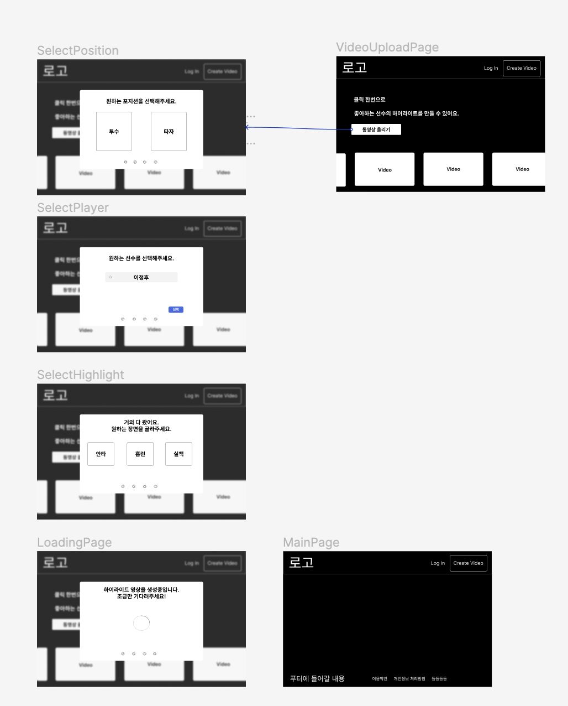
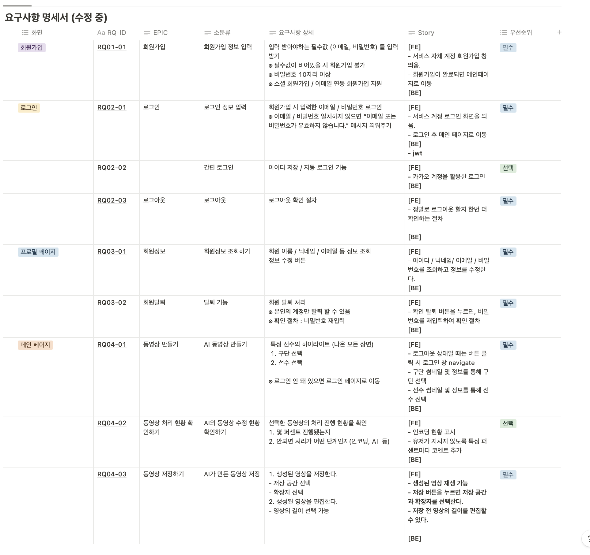
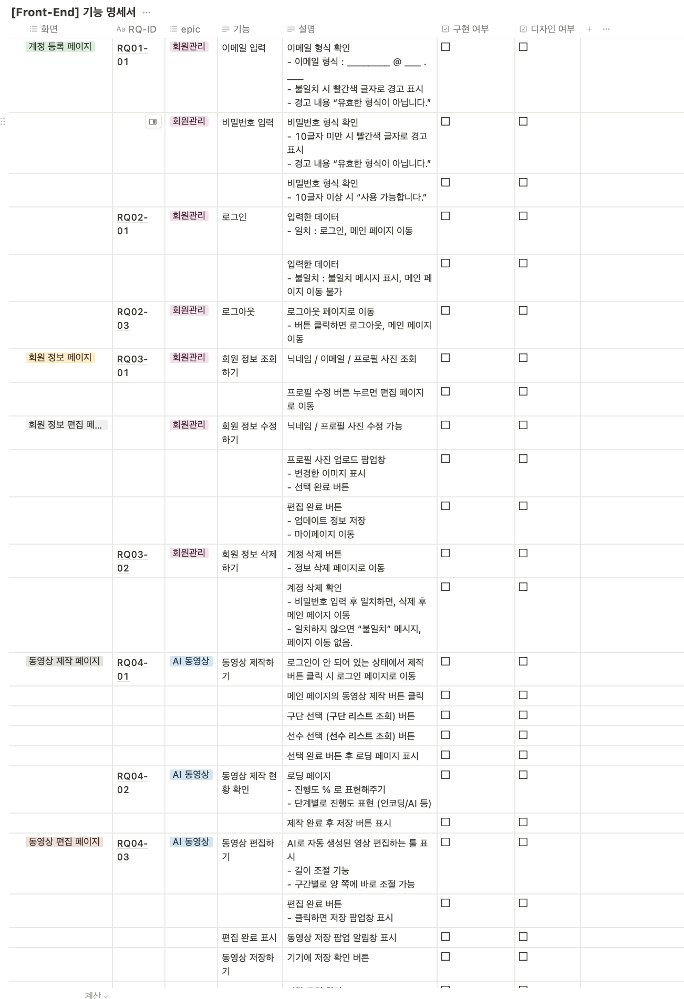
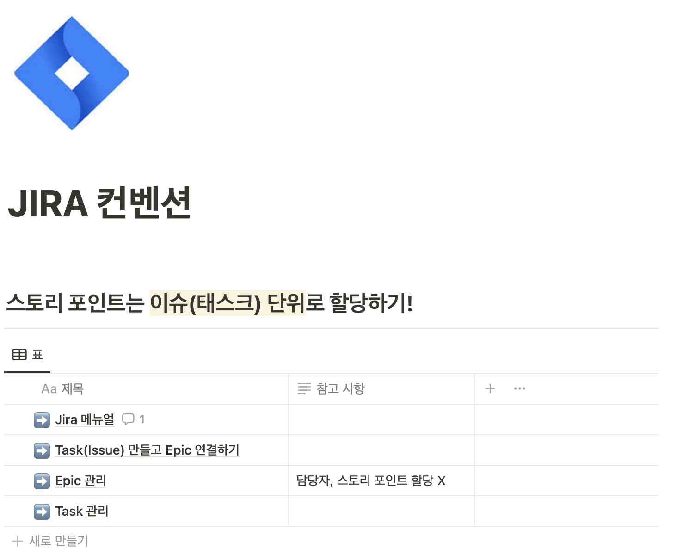
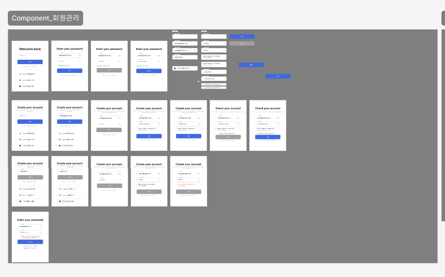
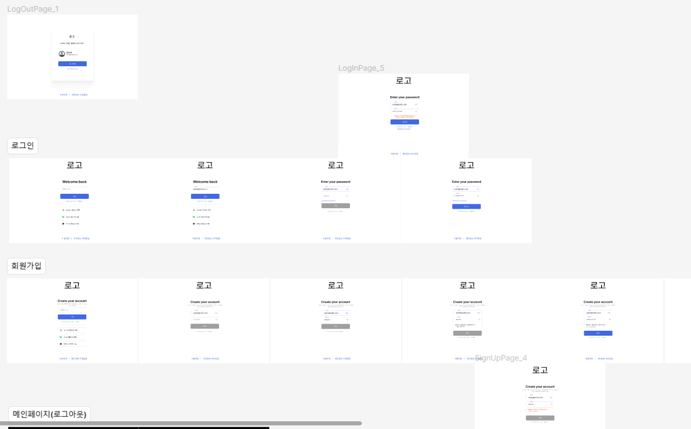
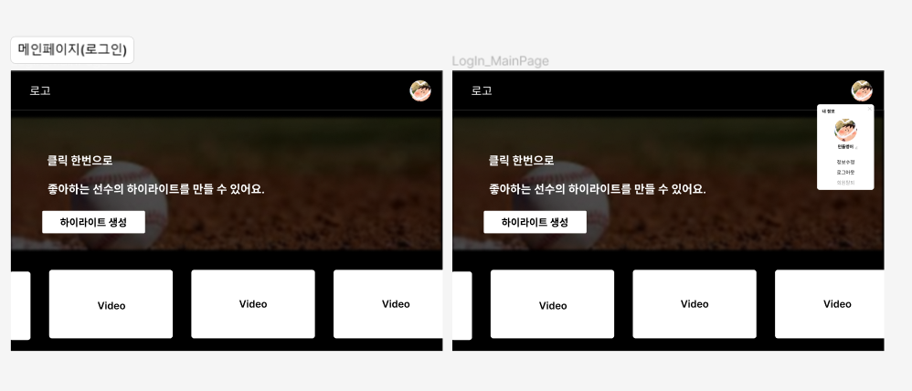
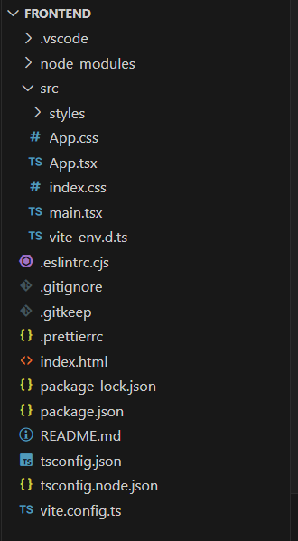
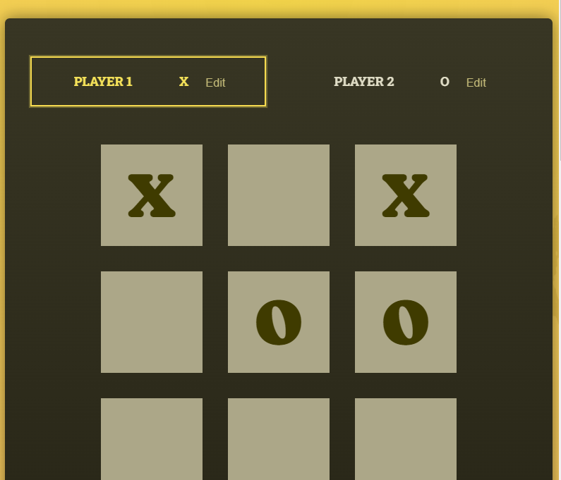

# 0115

- 요구사항 명세서 작성
- 기능 명세서 작성
- 컨설팅 후 프로젝트 방향 확립 : AI 동영상 편집 기능에 초점 맞추기로 결정
- 와이어 프레임 제작

---

# 0116

### 요구사항 명세서 수정

### Front-End 기능 명세서 작성

### JIRA 컨벤션 작성

---

# 0117

### 피그마 컴포넌트 생성 및 정리

### 와이어프레임_회원관리 페이지 디테일 추가

### 와이어프레임_회원정보 컴포넌트

---

# 0118

### Front-End 개발 환경 세팅

### 간단한 Tic-Tac-Toe 게임을 구현하며 React 구조 공부

---

# 0122

### 오늘은 몸이 좋지 않아 오전에 간단한 회의를 하고, 오후에 병원에 다녀왔습니다.
