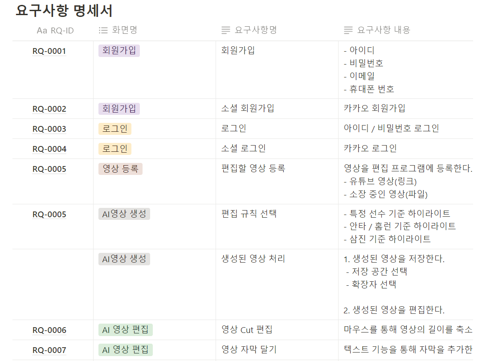
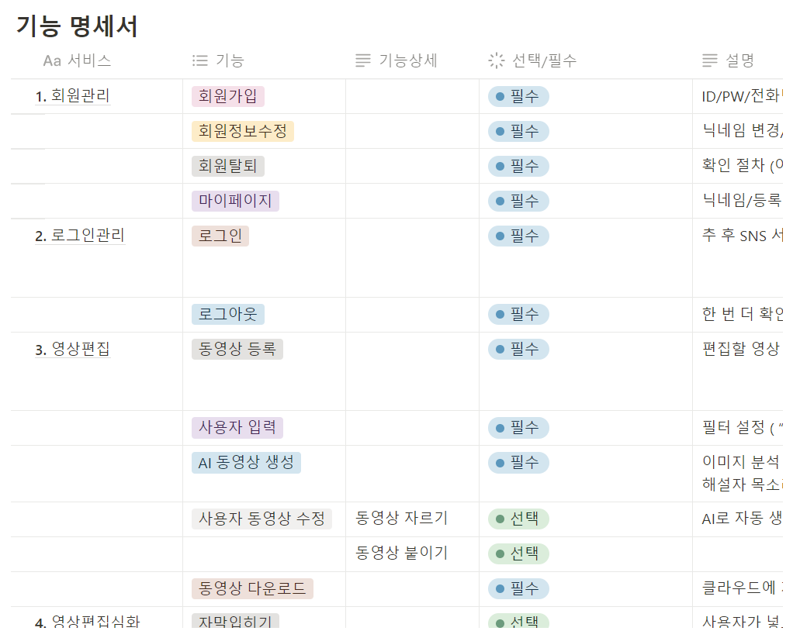

# 240115
[팀]
지난주에 정해진 '사용자 커스터마이징 스포츠 하이라이트 자동생성기'를 주제로
요구사항 명세서와 기능 명세서를 작성하였습니다.

[개인]
백엔드 파트를 나누어 개인 공부를 하기로 하였고
인프런 강의를 통해 딥러닝 공부를 시작하였습니다.

# 240116
[팀]
'사용자 커스터마이징 스포츠 하이라이트 자동생성기'를 야구로 한정짓기로 결정하고
설계 작업을 시작하였습니다.

[개인]
인프런 강의로 영상 속 인물인식 하는 방법에 관한 전반적인 개념을 잡았습니다.

# 240117
[팀]
프론트와 백으로 나누어 설계 마무리 작업을 가졌습니다.

[개인]
python opencv 라이브러리와 face_recognition 라이브러리를 사용하여
사진 10장으로 학습을 시킨 뒤
동영상에서 각 프레임마다 학습시킨 인물을 찾는 테스르를 진행해 보았습니다.
영상에서 선수가 헬멧을 착용하고 얼굴이 잘 나오는 거리가 아니라
얼굴 인식 성공률이 매우 낮았습니다.

# 240118
[팀]
프론트는 개발 환경 세팅 작업에 들어갔고 백은 서버를 여러대 사용할 예정이라
데이터의 흐름도 작성에 집중했습니다.

[개인]
python selenium 라이브러리를 사용하여 구글에서 이미지를 크롤링하는 코드를
작성하였습니다.
450여 장의 사진을 크롤링해 어제와 마찬가지로 face_recognition 라이브러리를 사용한
학습 및 테스트를 진행했습니다.
하지만 여전히 얼굴 인식 성공률이 매우 낮았습니다.

# 240122
[팀]
프론트 백 모두 각자 역할에 맞게 개발에 돌입했습니다.
프론트는 atomic 디자인에 따라 공통 컴포넌트 개발을
백은 서버 설정 및 회원가입 기능 구현을 시작하였습니다.

[개인]
낮은 성공률의 얼굴인식 대신 중계화면에 자막이 많은
야구의 특성을 고려하여 텍스트 인식으로 AI 컨셉을 바꾸었습니다.
python east text detection 모델로 동영상에서 text를 감지하고
ocr 기능을 제공하는 pytesseract 라이브러리를 사용하여 감지한 text를
recognition하는 기능을 테스트하였습니다.

# 240123
[팀]
프론트 백 모두 각자 역할에 맞게 개발 혹은 개인 공부를
진행했습니다.

[개인]
python moviepy 라이브러리를 사용하여 동영상 클립 만드는
방법을 익히고 text detection과 text recognition 결과
원하는 텍스트가 있는 프레임을 어떻게 모을지 로직을 고민했습니다.

# 240124
[팀]
프론트 백 모두 각자 역할에 맞게 개발을 진행했습니다.
또한 중간 발표 자료 만들기와 발표 내용에 관해 회의를 하고
발표 자료 역할 분담과 발표의 대략적인 개요를 정했습니다.

[개인]
사용자 입력 없이도 야구 동영상에 등장하는 투수와 타자 리스트를 
저장하고 이를 바탕으로 선수별 clip을 만들는 로직을 코딩하였습니다.
먼저, 야구 통계 사이트의 선수 명단을 긁어와 파일로 저장하였습니다.
이후 text recognition된 text를 전처리(한글만 남겨두고 나머지 요소들 제거)한 후
선수 명단에 속해 있는지 판단하여 속해있을 경우에만 이름과 영상 내 등장시간을 저장하는
방식으로 로직을 짰습니다.

# 240131
[팀]
서버 간 통신 테스트를 위해 프론트의 파일 업로드 부분, s3 부분, AI 서버 부분 담당
팀원끼리 파일명 양식을 정하고 메세지 큐를 전달하는 방법을 논의하였습니다.
또한 회원가입 및 로그인을 위해 프론트 로그인 및 파트 담당과 스프링 로그인 및 jwt 토큰
담당자간 토큰 전달 방식을 논의하였습니다.

[개인]
url만으로 youtube 동영상을 자동으로 다운받아 클립 영상을 제공하는 기능을
python 라이브러리를 활용하여 구현하고자 하였으나 에러를 해결하지 못하였습니다.
또한 야구중계 풀영상에도 선수별 하이라이트를 뽑아낼 수 있도록 동영상 편집 로직을
수정중이며 docker 파일도 작성하였습니다.
